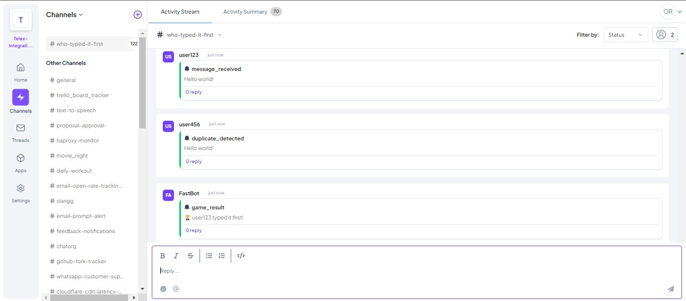

# 🚀 Telex "Who Typed It First?" Speed Game

This is a **Telex Modifier Integration** that detects when multiple users type the same message and announces **who was first** in the Telex channel. It encourages **fast typing, engagement, and fun competition.** 🎉

## Features
- Detects duplicate messages in a Telex channel
- Announces **who typed it first** in real-time
- Supports configurable settings via Telex
- Built with **Node.js, Express, TypeScript**
- Hosted on **Render** for seamless deployment

## Tech Stack
- **TypeScript** - Strongly typed JavaScript
- **Node.js** - Backend runtime
- **Express.js** - Web framework
- **Axios** - HTTP client for Telex Webhooks
- **Helmet** - Security headers
- **CORS** - Cross-origin request handling
- **Morgan** - Request logging
- **Jest** - Unit testing
- **Supertest** - API testing
- **Render** - Deployment hosting

## Folder Structure
- **src/**
  - **constants/** → Environment & Integration JSON
  - **core/speed-game/** → Main game logic
  - **routes/** → Express API routes
  - **utils/** → Helper utilities
- **tests/** → Unit & API tests
- **.env** → Environment variables
- **README.md** → This file
- **package.json** → Node.js dependencies
- **tsconfig.json** → TypeScript configuration

## 🚀 Setup & Installation

### 1️⃣ Clone the Repository
```sh
git clone https://github.com/telexintegrations/telex-who-typed-it-first.git
cd telex-who-typed-it-first
```

### 2️⃣ Install Dependencies
```sh
npm install
```

### 3️⃣ Set Up Environment Variables
Create a `.env` file in the root directory and add:
```sh
PORT=5000
TELEX_WEBHOOK_URL="https://api.telex.im/webhook/YOUR_WEBHOOK_ID"
```

### 4️⃣ Run the Project Locally
```sh
npm run dev
```
Server should start on `http://localhost:5000`.

## 🌍 API Endpoints
| Method | Endpoint          | Description |
|--------|------------------|-------------|
| `POST` | `/api/speed-game` | Checks who typed a message first |
| `GET`  | `/api/integration` | Returns integration JSON |

## 📝 Telex Integration JSON
The integration JSON is accessible at:
`https://telex-who-typed-it-first.onrender.com/api/integration`

### 🛠 How to Add the Integration in Telex
1. Go to **Telex → Integrations → Add Custom Integration**
2. Enter the integration JSON URL:
   `https://telex-who-typed-it-first.onrender.com/api/integration`
3. Click **Save & Enable**
4. The bot will now process messages in your channel!

## 🧪 Testing the Integration

### 1️⃣ Run Unit Tests
Ensure you have installed Jest:
```sh
npm install --save-dev jest ts-jest @types/jest supertest @types/supertest
```

Run tests:
```sh
npm test
```

### 2️⃣ Verify API Works Locally
Use **Postman or CURL** to test the `/api/speed-game` endpoint.

#### ✅ Test Case 1: First Unique Message
```sh
curl -X POST http://localhost:5000/api/speed-game \
     -H "Content-Type: application/json" \
     -d '{"username": "Alice", "message": "Hello World"}'
```
**Expected Response**
```json
{
  "message": "Message recorded."
}
```

#### ✅ Test Case 2: Duplicate Message (Within 5 Seconds)
```sh
curl -X POST http://localhost:5000/api/speed-game \
     -H "Content-Type: application/json" \
     -d '{"username": "Bob", "message": "Hello World"}'
```
**Expected Response**
```json
{
  "message": "🏆 Alice typed it first!"
}
```

### 3️⃣ Verify Inside Telex
1. Open your **Telex channel**
2. Type: `"Hello World"`
3. Have another user type the same message **within 5 seconds**
4. The bot should reply:
   ```
   ⚡ Speed Game Alert!
   Message: "Hello World"
   🏆 Alice typed it first!
   ```

## 🔗 Deployment (Render)
The API is hosted on **Render** at:
`https://telex-who-typed-it-first.onrender.com`

To deploy updates:
```sh
git push origin main
```
Render will automatically detect and deploy changes.

## 📸 Screenshots of Integration Working in Telex

🔹 **Example: Duplicate Message Detected**


> **Note:** Upload screenshots to **Imgur, GitHub Issues, or Cloudinary** and replace `your-image-url.com` with the actual image URL.

## 🎯 Future Enhancements
- 🏆 **Leaderboard tracking for fastest users**
- 📊 **Telex dashboard integration**
- 🎨 **Custom themes & bot styling**

## 📝 License
This project is licensed under the MIT License.
